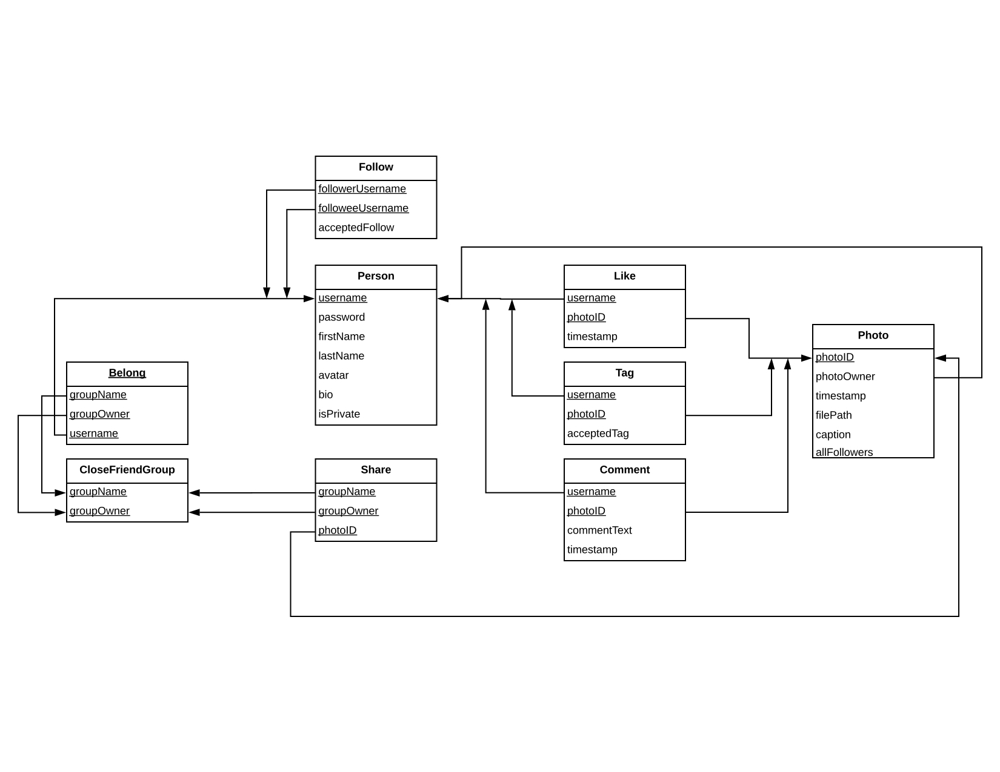
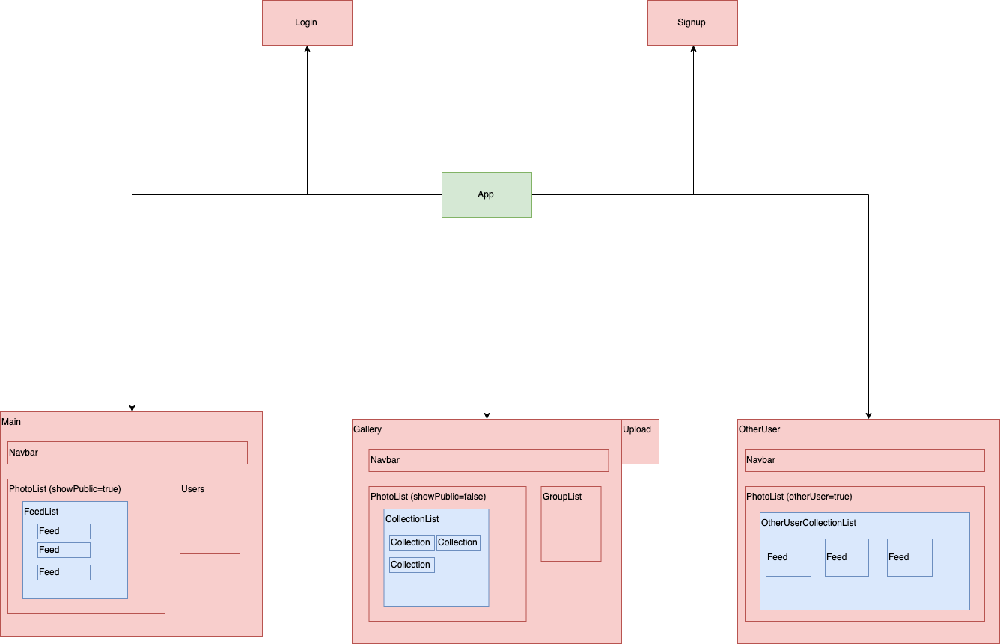

# Finstagram

this is a project for CS-UY 3083 course 🔥

## ⚙️Technical Stack

- Node.js & Express as backend framework
- React.js as frontend framework
- Semantic-ui-react as css component
- MySQL as database

## Database structure

## Authentication System

This app use session based authentication

## Frontend Components Structure

## Backend api

[Backend api endpoint](./routes/api/endpoints.md)

## Todo

- [x] Store session id in cookie
- [x] React-router protected route
- [x] Not storing session-id of all request
- [ ] Show upload error alert modal
- [x] Tag other user in a post
- [ ] Post photo with a url
- [x] add a button to the right of group list that can create new group
- [x] implement add user into your group
- [x] custom alert component

### Features

- [x] Sign up system
- [x] Log in system
- [x] Session
- [x] Upload photo
- [x] View photo and data
- [x] Create close friend group
- [ ] Responsive

## Notes

[Authentication](./authentication.md)
